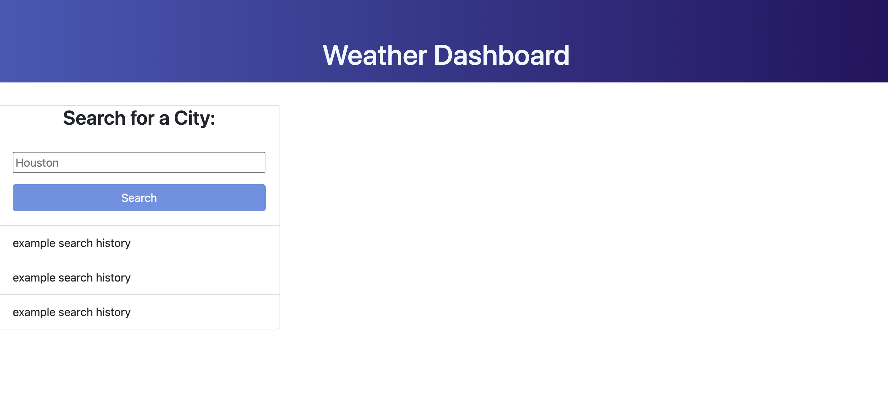

# Weather_Dashboard
Challenge 6

Deployed Link: https://kmaddox2122.github.io/Weather_Dashboard/

Screenshot:

## Assignment Description

In this assignment, we have been asked to create a weather dashboard that will populate current and future weather conditions based on an input from user in a search field. Users will also be able to track previous searches in their search history and easily bring up the weather for those locations again. 

## Application functionality

Currently, I have started the HTML and CSS for this assignment. Using bootstrap, I have designed the page to look similar to the mock-up provided. In javascript, I have created variables and pulled the API for lat and lon from Open Weather API.

## Acceptance Criteria from directions

"GIVEN a weather dashboard with form inputs
WHEN I search for a city
THEN I am presented with current and future conditions for that city and that city is added to the search history
WHEN I view current weather conditions for that city
THEN I am presented with the city name, the date, an icon representation of weather conditions, the temperature, the humidity, and the wind speed
WHEN I view future weather conditions for that city
THEN I am presented with a 5-day forecast that displays the date, an icon representation of weather conditions, the temperature, the wind speed, and the humidity
WHEN I click on a city in the search history
THEN I am again presented with current and future conditions for that city"
 

## Technologies used in this project were:
  1. HTML
  2. CSS
  3. Javascript
  4. Bootstrap
  7. Chrome Web Browser & Dev Tools

## Take-aways from this project
    -I am gaining familiarity with the concept of APIs and the navigation thereof. 
    -I am continuing to practice using HTML, CSS, Bootstrap, and JavaScript.

------------------------------------------------------------

This code follows the MIT License.

